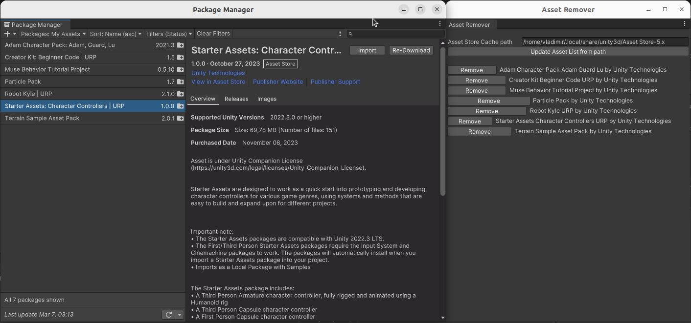

# Asset Remover for Unity

Remove downloaded Unity Asset Store assets from your drive without leaving Unity Editor

_Note: not tested on Mac OS X._

_Note: may not work well with large collection of assets._

## Installation

Via Package Manager: `https://github.com/marked-one/AssetRemover.git`

Using version: `https://github.com/marked-one/AssetRemover.git#1.0.0`

Or you can simply copy the `AssetRemoverWindow.cs` file into your project.

## Usage

Open the Asset Remover window via `Tools/Asset Remover`.

You should probably also open the Package Manager window alongside the Asset Remover, like in the screenshot above. In Package Manager window, switch to `My Asssets` and use `Filters` to set `Status->Downloaded`. 

If needed, change the `Asset Store Cache path` to the real path to the Asset Store cache folder and then press the `Update Asset List from path` button.

Use the `Remove` buttons to remove assets. Asset is immediately removed from the drive.

## License

[MIT license](LICENSE.md)

> MIT License
>
> Copyright (c) 2024 Vladimir Klubkov
>
> Permission is hereby granted, free of charge, to any person obtaining a copy
of this software and associated documentation files (the "Software"), to deal
in the Software without restriction, including without limitation the rights
to use, copy, modify, merge, publish, distribute, sublicense, and/or sell
copies of the Software, and to permit persons to whom the Software is
furnished to do so, subject to the following conditions:
>
> The above copyright notice and this permission notice shall be included in all
copies or substantial portions of the Software.
>
> THE SOFTWARE IS PROVIDED "AS IS", WITHOUT WARRANTY OF ANY KIND, EXPRESS OR
IMPLIED, INCLUDING BUT NOT LIMITED TO THE WARRANTIES OF MERCHANTABILITY,
FITNESS FOR A PARTICULAR PURPOSE AND NONINFRINGEMENT. IN NO EVENT SHALL THE
AUTHORS OR COPYRIGHT HOLDERS BE LIABLE FOR ANY CLAIM, DAMAGES OR OTHER
LIABILITY, WHETHER IN AN ACTION OF CONTRACT, TORT OR OTHERWISE, ARISING FROM,
OUT OF OR IN CONNECTION WITH THE SOFTWARE OR THE USE OR OTHER DEALINGS IN THE
SOFTWARE.
